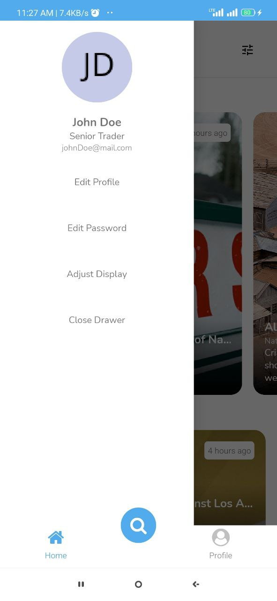

# NewsApp

This is my react native portfolio project example which is use atomic design, styled-components, redux state management. 
And this is the app looks like

## To use this app
Make sure you have development environtment and then run
- npm install
- yarn start
- yarn android
